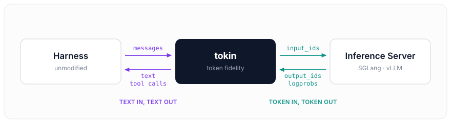

# tokin
Make any agent harness token-native.

  

The harness keeps speaking text over a standard chat-completions API. The inference
server only ever receives token ids. tokin owns the chat template in between, so the
ids a model generated on one turn are the ids the next turn's prompt carries — no
detokenize/retokenize round trip, no silent drift.
